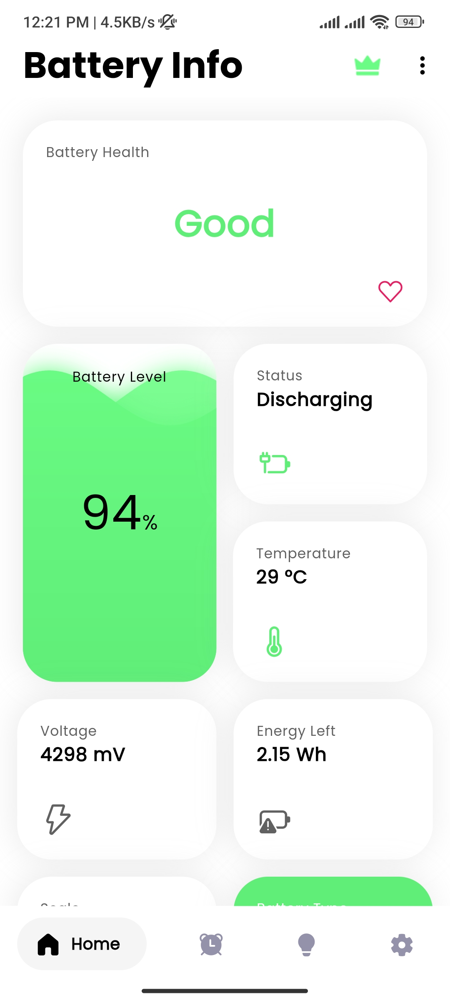
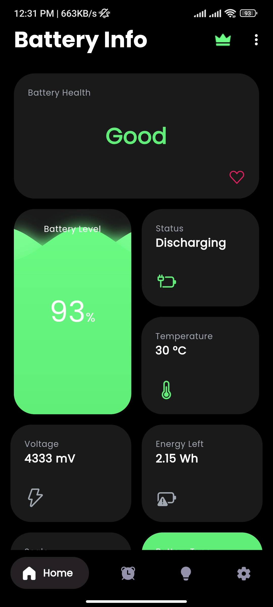
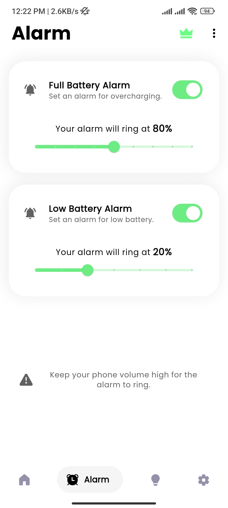
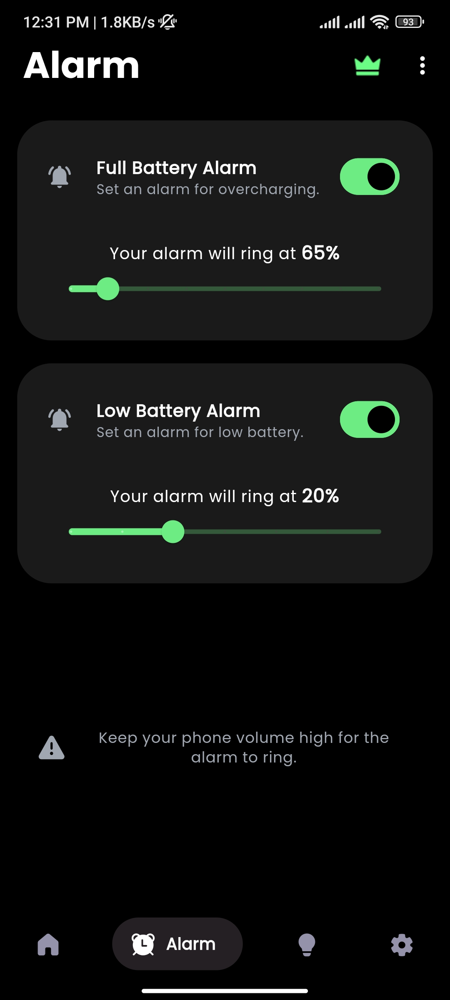
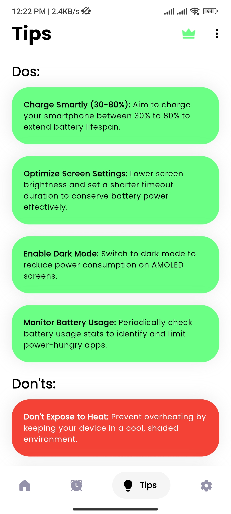
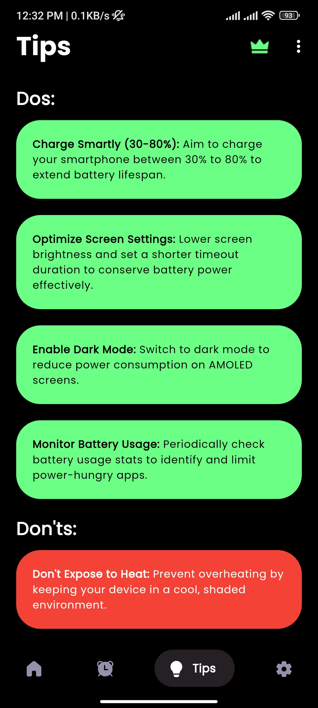
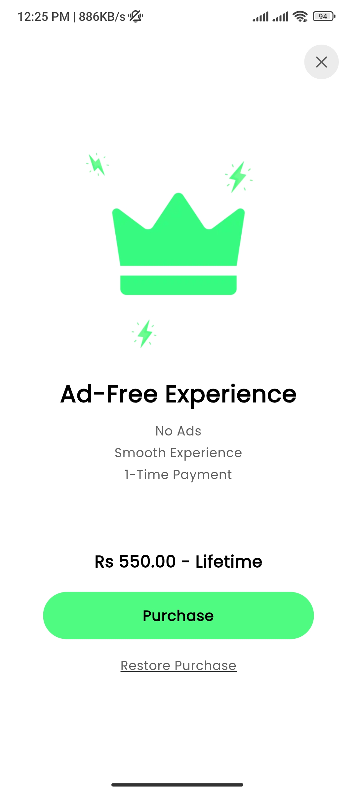

# Battery Care App

Battery Care is an Android application designed to help users monitor and maintain their device's battery health efficiently. It offers features like real-time battery statistics, charging alarms for full or low battery levels, temperature monitoring, and more.

## Features

- **Battery Health Monitoring**: Check the overall health of your battery and receive suggestions to improve its longevity.
- **Intelligent Charging Alarm**: Set custom alarms to notify when the battery reaches a certain level, either full or low, to prevent overcharging or draining.
- **Real-Time Battery Stats**: View accurate details on the remaining power, voltage, type, and estimated time until full charge.
- **Temperature Alerts**: Get notified if your battery temperature goes beyond the safe threshold.
- **Ad-Free Version**: Purchase an Ad-Free version of the app to get rid of Ads for the lifetime.

## Screenshots

  
  

  
  

  
  

  
  

  

